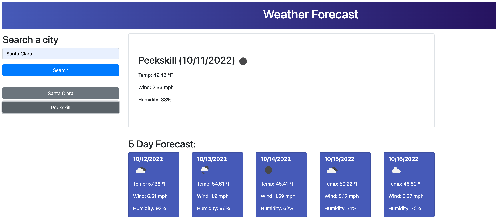

# Five Day Forecast

## Description

This repository contains a website that allows you to view 5 day forecast for a city of your choosing. It utilizes 3rd party APIs in order to fetch the information, and local storage to persist previous searches and results.

This repository utilizes
* HTML
* CSS
* JavaScript
* Bootstrap
* jQuery
* dayjs

[Deployed Site](https://joedjensen.github.io/five-day-forecast/)

## Installation 

N/A

## Usage 

Search for a city of interest. The forecast will be populated. If there is not an existing button for this city, one will be added. 



The button will reload results from local storage, not do a fresh pull from the API. Searching the city again in the main search bar will do a fresh API pull, and not add a button if one exists. An improvement would be to additionally store the time that results were stored, and do a fresh API pull if they are stale. It was decided to do it this way to improve latency on repeated attempts and to use local storage more interestingly.

## Code Snippets

The number of buttons is limited to 10. When an new city is encountered, we check if there are already 10 buttons. If there are, we delete the first item. Then we empty the button list and repopulate with the new list, newest first (prepending).
```Javascript
if (!(data.city.name in cityHistory)) {
    if (Object.keys(cityHistory).length > 9) {
        delete cityHistory[Object.keys(cityHistory)[0]]
        buttonListEl.empty()
        for (const city in cityHistory) {
            addButtonToList(city)
        }
    }
    addButtonToList(data.city.name)
}
```

We use event delegation and a attribute called data-city-name set on each button in the list to fetch correct results from local storage
```Javascript
buttonListEl.on("click", "button", fetchFromLocal)
function fetchFromLocal(event) {
    cityHistory = JSON.parse(localStorage.getItem("city-history"))
    var cityObject = cityHistory[$(this).attr("data-city-name")]
    populateToday(cityObject)
    populate5day(cityObject)
}
```
## License

Refer to the license in the Github repo.
